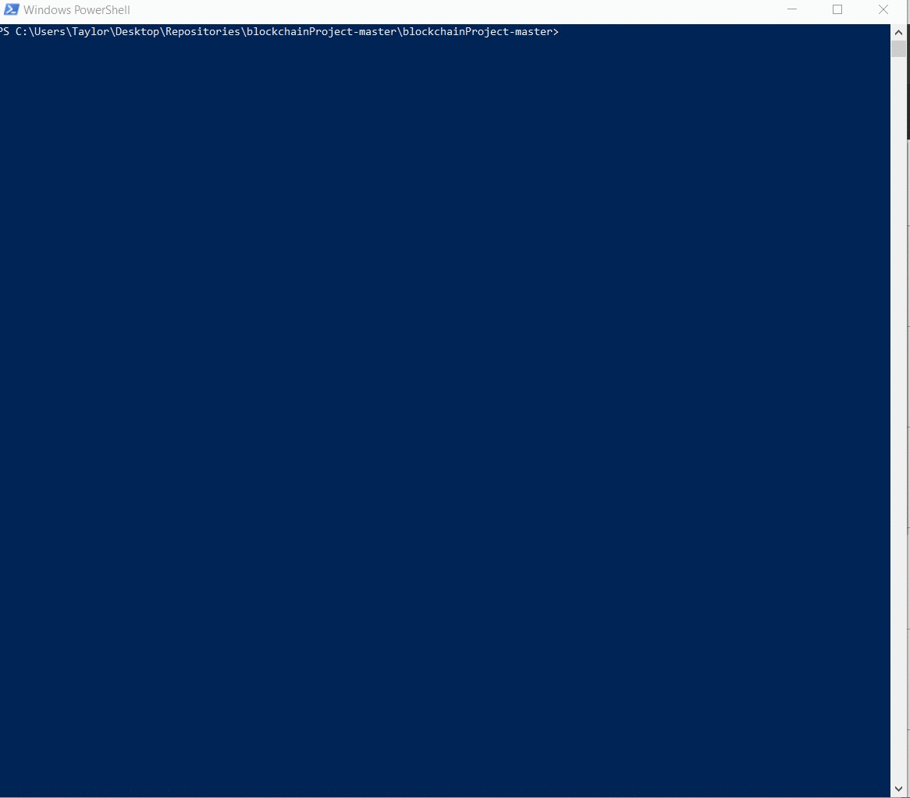

<h1> Paper Cut </h1>

 

PaperCut is a decentralized application developed with the intention of making buying and selling tickets easier. EventOwners(Artists, Venues, and Agents) can create events and establish tickets for those events. They can determine different types of tickets and price levels. Users can buy tickets directly from EventOwners; eliminating a middleman and ensuring the validity of their tickets.  
 
In version 2.0, we hope to add EventOwner authentication and the selling function. Users will be able to sell their tickets to one another without the worry of fraudulent tickets or exorbitant prices.

<h2> :floppy_disk: Installation </h2>
<ul>
  <li> Install <a href="https://nodejs.org/en/download/"> Node.js </a> </li>
  <li> Install <a href="https://metamask.io/"> MetaMask</a> </li>
  <ul> <li> Create an account </li>
  <li> Log out of account to ensure the handshake will be made upon opening the dApp</ul>
  <li> Install <a href="https://truffleframework.com/ganache"> Ganache </a> </li>
  <li> Install Truffle </li> 
            
    npm install truffle -g
   
   
  <li> Open Ganache </li>
  <li> Clone the repository </li>
  <ul><li> Unzip the repository </li>
  <li> Navigate to the repository using cmd, Terminal or PowerShell </li> </ul>
  <li> Compile the contract </li>
  
    
    truffle migrate --reset --all 
    
  
  
   <li> Open the dApp </li>
  
      
    npm run dev
  
 
  :rotating_light: If you see any error messages about lite-server or browsersync, navigate to the node modules folders  &nbsp;&nbsp;&nbsp;&nbsp;&nbsp;&nbsp;&nbsp;&nbsp;&nbsp;  and   delete the lite-server or browsersync folders. Navigate back to the main folder and 
    
    npm install
    npm run dev

  </ul>
 
<h2> :computer: Usage </h2>

 The dApp should open to the main page. MetaMask should ask you to log in and ask to connect to your account. If your Ganache is not connected to MetaMask, now is the time to import an account from Ganache into Metamask. Your MetaMask and Ganache should be connected to the same port (7545).  

 

 You should have two options, to create an event and to buy tickets. You should create an event first. 

<ul>
  <li>  Click Create an Event </li>
  <li> Enter your desired inputs into these fields and click submit or more tickets </li>
  <ul><li>MetaMask will ask you for permission.
The window may flash very quickly. If it does, you need to click on the fox icon in the upper right corner of your toolbar. </li>
    <li> Accept the transaction </li> </ul>
  <li> Enter your desired inputs into the these fields and click submit or  </li>
  <ul><li>:warning:MetaMask should ask you for permission. However, this is an issue we run into while developing this dApp. If a window does pop up accept the transaction  </li></ul>
 <li> If you click More Tickets, the page will refresh and allow you to add more tickets. </li>
  <li> If you click Submit, the page will redirect you to the homepage. </li>
 </ul>
 
 Once you have created an event, you should proceed to Buy Tickets 

 <ul><li>Choose your selection and click submit </li>
    <ul><li>:warning:MetaMask should ask you for permission. However, this is an issue we run into while developing this dApp. If a window does pop up accept the transaction</li></ul>
  </ul>

<h2> :books: What We Learned </h2>
<ul>
<li> Developing Web Applications</li>
  <ul> <li> Bootstrap </li>
  <li>JavaScript</li>
  <li>HTML</li>
  <li>CSS</li>
  <li> FrontEnd vs. Backend </li> </ul>
<li> Truffle Development Tools </li>
<ul><li> Developer Console </li>
  <li> Test Chains </li></ul>
  <li>Blockchain Development Fundamentals </li>
  <li>Software Engineering Principles </li>
   <ul><li> Modularity </li>
  <li> Incremental Development </li>
  <li> Scope </li>
  <li> K.I.S.S :grin:</li> </ul>
  </ul>

<h2> :pencil:Notes </h2>

 This dApp does have some errors within it. However, general functionality/proof of concept is there. The dApp can connect to the blockchain and perform transactions. More testing will be required to add final functionality to the dApp. 

<h2> :video_camera: Demo </h2>

<h2> Contributors </h2>

 These people contributed to the alpha version of PaperCut :ticket:
<ul>
  <li><a href="https://github.com/Taylor-McNeil">Taylor McNeil</a> </li>
  <li><a href="https://github.com/alazynoob">Gavin Gniewek<a/></li>
  <li><a href="https://github.com/AnthonyDavis2"> Anthony Davis</a></li> 
  <li><a href="https://github.com/jordan-i-jones"> Jordan Jones</a></li>
  <li><a href="https://github.com/GWoodz">Gregory Woodcox</a></li>
  </ul>
